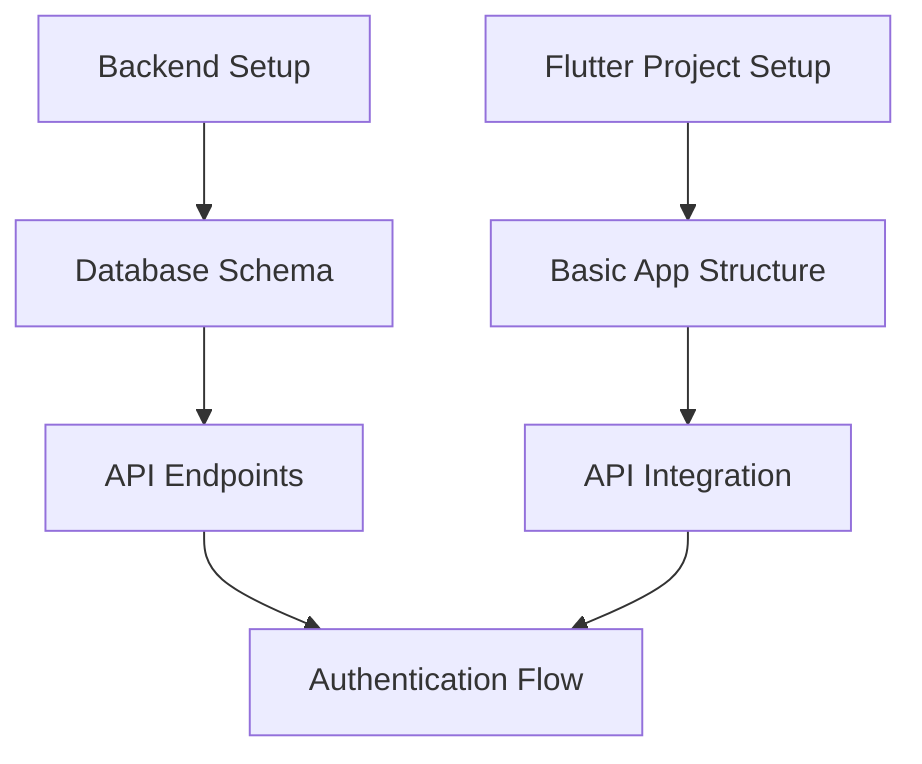
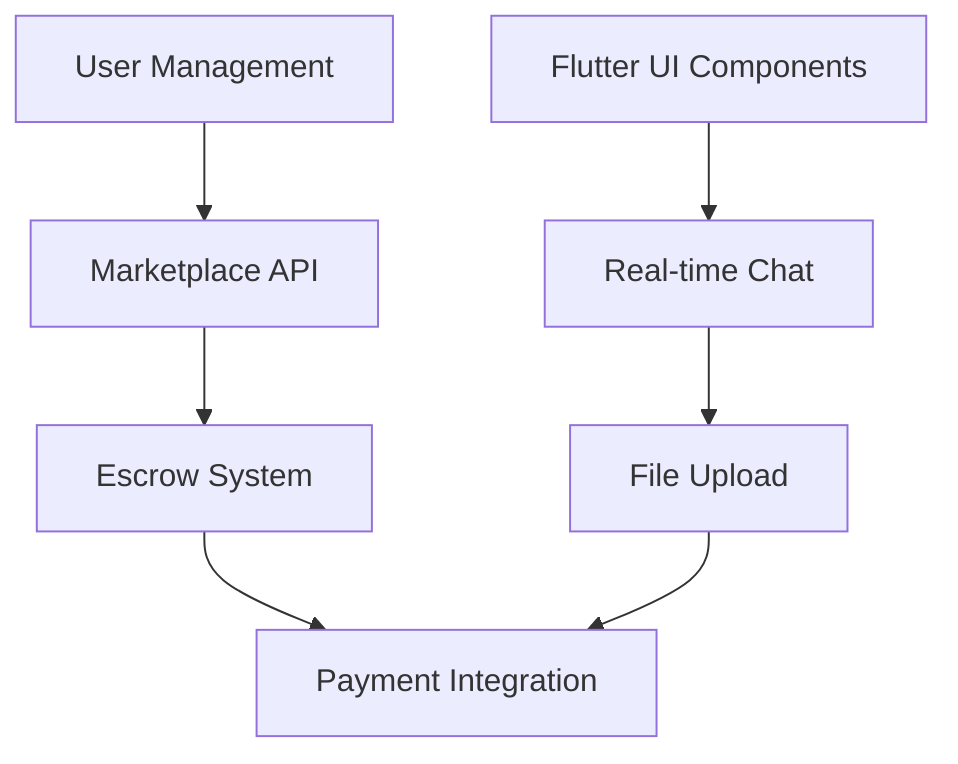
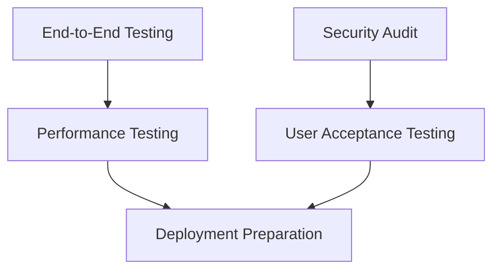
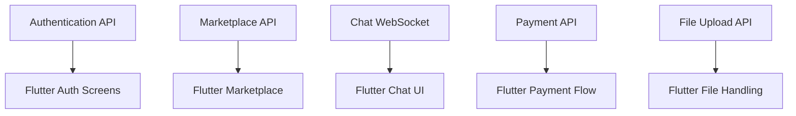

# Development Collaboration Workflow

## Team Structure

### Development Team Composition
```
Backend Developer (You)
├── Node.js/TypeScript Expertise
├── Database Design & Management
├── API Development & Integration
├── Payment Systems (Paymob)
└── DevOps & Deployment

Flutter Developer (Your Friend)
├── Mobile App Development
├── UI/UX Implementation
├── Real-time Features (WebSocket)
├── File Upload Handling
└── Platform-specific Optimizations
```

## Communication Protocols

### Daily Standup Format
```markdown
**Daily Check-in Template:**

**What I worked on yesterday:**
- [ ] Completed tasks

**What I'm working on today:**
- [ ] Current tasks

**Any blockers:**
- [ ] Issues needing discussion

**API dependencies needed:**
- [ ] Required endpoints
```

### Communication Channels
- **Primary**: GitHub Issues for task tracking
- **Secondary**: Discord/Telegram for quick discussions
- **Tertiary**: Email for formal decisions
- **Emergency**: Phone call for critical blocking issues

## Development Workflow

### Git Workflow Strategy

#### Repository Structure
```
trusted-platform/
├── backend/                    # Node.js/TypeScript API
│   ├── src/
│   ├── tests/
│   ├── docs/
│   └── README.md
├── frontend/                   # Flutter mobile app
│   ├── lib/
│   ├── android/
│   ├── ios/
│   ├── test/
│   └── pubspec.yaml
└── docs/                       # Shared documentation
```

#### Branch Naming Convention
```bash
# Feature branches
feature/backend-user-auth
feature/frontend-login-screen
feature/integration-payment-api

# Bug fixes
bugfix/backend-escrow-calculation
bugfix/frontend-chat-crash

# Hotfixes
hotfix/critical-payment-failure
```

### Development Phases

#### Phase 1: Foundation Setup (Week 1-2)


**Collaboration Points:**
- Backend developer creates initial database schema
- Share API endpoint specifications
- Flutter developer sets up HTTP client configuration
- Joint testing of authentication flow

#### Phase 2: Core Features (Week 3-6)


**Collaboration Points:**
- Weekly API review meetings
- Shared testing on staging environment
- Real-time feedback on UI/UX integration
- Joint debugging sessions

#### Phase 3: Integration & Testing (Week 7-8)


## API Integration Strategy

### API Contract Definition

#### Shared Interface Definitions
```typescript
// shared/types/api.ts
export interface ApiResponse<T> {
  success: boolean;
  data: T;
  message?: string;
  errors?: string[];
}

export interface User {
  id: string;
  email: string;
  username: string;
  role: 'user' | 'trusted' | 'admin';
  // ... other fields
}

export interface Listing {
  id: string;
  title: string;
  price: number;
  seller_id: string;
  // ... other fields
}
```

#### Backend Developer Responsibilities
1. **API Documentation**: Maintain up-to-date OpenAPI/Swagger specs
2. **Error Codes**: Document all error responses and status codes
3. **Rate Limits**: Specify rate limiting for each endpoint
4. **Authentication**: Provide JWT token generation and validation
5. **WebSocket Events**: Document real-time event structures

#### Flutter Developer Responsibilities
1. **HTTP Client Setup**: Configure Dio/Http client with interceptors
2. **Error Handling**: Implement user-friendly error messages
3. **Loading States**: Show appropriate loading indicators
4. **Offline Support**: Handle network failures gracefully
5. **Token Management**: Implement automatic token refresh

### API Version Management

#### Version Strategy
```bash
# API Versioning
/v1/auth/login     # Current stable
/v2/auth/login     # Breaking changes only

# Deprecation Notice
X-API-Deprecation-Warning: "v1 will be removed on 2024-12-31"
```

## Code Sharing & Dependencies

### Shared Packages
```bash
# Backend Dependencies
npm install axios          # HTTP client for external APIs
npm install socket.io      # WebSocket server
npm install multer         # File upload handling
npm install bcrypt         # Password hashing
npm install jsonwebtoken   # JWT tokens
npm install cors           # CORS handling
npm install helmet         # Security headers
npm install compression    # Response compression

# Flutter Dependencies
flutter pub add http                    # HTTP client
flutter pub add socket_io_client       # WebSocket client
flutter pub add file_picker            # File selection
flutter pub add image_picker           # Camera/gallery
flutter pub add flutter_secure_storage # Secure storage
flutter pub add provider               # State management
flutter pub add cached_network_image   # Image caching
flutter pub add intl                   # Internationalization
```

### Environment Configuration

#### Backend Environment Template
```bash
# .env.template (Backend)
NODE_ENV=development
PORT=3000
DATABASE_URL=postgresql://localhost:5432/trusted
JWT_SECRET=your-secret-key
PAYMOB_API_KEY=your-paymob-key
REDIS_URL=redis://localhost:6379
FRONTEND_URL=http://localhost:4000
```

#### Flutter Environment Configuration
```dart
// lib/config/env.dart
class Environment {
  static const String apiBaseUrl = String.fromEnvironment(
    'API_BASE_URL',
    defaultValue: 'http://localhost:3000',
  );

  static const String socketUrl = String.fromEnvironment(
    'SOCKET_URL',
    defaultValue: 'http://localhost:3000',
  );

  static const String appVersion = '1.0.0';
}
```

## Development Tools & Setup

### Backend Development Environment
```bash
# Required Tools
Node.js 18+
PostgreSQL 15+
Redis 7+ (for caching)
Git

# Development Setup
npm install
npm run dev          # Development server with hot reload
npm run build        # Production build
npm run test         # Run tests
npm run lint         # Code linting
npm run migrate      # Database migrations
```

### Flutter Development Environment
```bash
# Required Tools
Flutter SDK 3.0+
Android Studio (for Android development)
Xcode (for iOS development, macOS only)
Git

# Development Setup
flutter pub get      # Install dependencies
flutter run          # Run on connected device/emulator
flutter test         # Run tests
flutter analyze      # Code analysis
flutter build apk    # Build Android APK
flutter build ios    # Build iOS (macOS only)
```

## Testing Strategy

### Backend Testing
```typescript
// tests/user.test.ts
describe('User API', () => {
  test('should create user successfully', async () => {
    const response = await request(app)
      .post('/auth/register')
      .send(validUserData);

    expect(response.status).toBe(201);
    expect(response.body.success).toBe(true);
  });
});
```

### Flutter Testing
```dart
// test/login_test.dart
void main() {
  group('LoginScreen', () {
    testWidgets('should show error for invalid credentials', (tester) async {
      await tester.pumpWidget(LoginScreen());
      // ... test implementation
    });
  });
}
```

### Integration Testing
```dart
// test/integration/transaction_flow_test.dart
void main() {
  group('Complete Transaction Flow', () {
    testWidgets('should complete full purchase process', (tester) async {
      // Test complete user journey
      // 1. Login
      // 2. Browse listings
      // 3. Make purchase
      // 4. Complete transaction
    });
  });
}
```

## Deployment Coordination

### Staging Environment
```yaml
# docker-compose.staging.yml
version: '3.8'
services:
  backend:
    image: trusted-backend:staging
    environment:
      - NODE_ENV=staging
      - DATABASE_URL=postgresql://staging-db/trusted

  frontend:
    image: trusted-flutter:staging
    environment:
      - API_BASE_URL=https://staging-api.trusted.com

  database:
    image: postgres:15
    environment:
      - POSTGRES_DB=trusted
```

### Production Deployment Checklist
```markdown
**Pre-Deployment:**
- [ ] All tests passing
- [ ] Code review completed
- [ ] Database migrations ready
- [ ] Environment variables updated
- [ ] Backup created

**Deployment Steps:**
- [ ] Deploy backend to staging
- [ ] Test API endpoints
- [ ] Deploy frontend to staging
- [ ] End-to-end testing
- [ ] Deploy to production
- [ ] Monitor for issues

**Post-Deployment:**
- [ ] Verify all services running
- [ ] Test critical user flows
- [ ] Monitor performance metrics
- [ ] Check error logs
```

## Conflict Resolution

### Merge Conflict Resolution Process
1. **Identify Conflict**: Git merge shows conflicting files
2. **Analyze Impact**: Understand what each developer changed
3. **Communicate**: Discuss resolution approach
4. **Test Resolution**: Ensure changes work together
5. **Commit Resolution**: Document resolution in commit message

### Code Review Guidelines
```markdown
**Review Checklist:**
- [ ] Code follows project conventions
- [ ] No breaking changes introduced
- [ ] Tests included for new functionality
- [ ] Documentation updated
- [ ] Performance impact considered
- [ ] Security implications reviewed
```

## Knowledge Sharing

### Documentation Maintenance
- **API Documentation**: Backend developer maintains API docs
- **UI Documentation**: Flutter developer documents screens and flows
- **Integration Guides**: Joint responsibility for integration docs
- **Troubleshooting Guides**: Both contribute based on expertise

### Technical Debt Management
```markdown
**Technical Debt Items:**
- [ ] TODO: Implement proper error handling in payment flow
- [ ] FIXME: Optimize image loading in marketplace
- [ ] NOTE: Consider implementing offline queue for chat messages
- [ ] REFACTOR: Extract common API calling logic
```

## Risk Management

### Critical Path Dependencies


### Rollback Strategy
```bash
# Emergency Rollback Commands
git revert HEAD~1 --no-edit
coolify deploy --project trusted-backend --version previous
coolify deploy --project trusted-frontend --version previous

# Database Rollback
psql -d trusted -f backup_rollback.sql
```

## Success Metrics

### Development Velocity
- **Sprint Completion Rate**: Target 80%+ story points completed
- **Code Review Turnaround**: <24 hours for non-critical reviews
- **Deployment Frequency**: Weekly deployments to staging
- **Bug Rate**: <5% of features require hotfixes

### Code Quality
- **Test Coverage**: >80% for both backend and frontend
- **Technical Debt Ratio**: <10% of total codebase
- **Security Vulnerabilities**: Zero high-severity issues
- **Performance Score**: >90 on Lighthouse/Core Web Vitals

## Escalation Procedures

### When to Escalate
- **Blocking Issues**: Development completely stopped
- **Security Concerns**: Potential vulnerabilities discovered
- **Performance Problems**: Critical performance degradation
- **Integration Failures**: APIs not working after multiple attempts

### Escalation Path
1. **Self-Resolution**: Try to solve independently first
2. **Peer Discussion**: Discuss with other developer
3. **Technical Consultation**: Seek external expertise if needed
4. **Project Owner**: Escalate to project owner for decisions

## Continuous Improvement

### Retrospective Meetings
```markdown
**Sprint Retrospective Template:**

**What went well:**
- [ ] Successful collaboration on X feature

**What could be improved:**
- [ ] API documentation could be more detailed

**Action items:**
- [ ] Schedule weekly API review meeting
- [ ] Create shared testing checklist
```

### Process Optimization
- **Automation**: Implement more CI/CD automation
- **Tooling**: Adopt better development tools
- **Communication**: Improve documentation and knowledge sharing
- **Quality**: Enhance testing and code review processes