# Missing Flows for Optimal Performance and Scalability

## Performance Analysis Overview

### Current Architecture Assessment

**Strengths:**
- Well-defined MVP scope with clear boundaries
- Proper separation of concerns (backend/frontend)
- Real-time features with WebSocket implementation
- File upload handling for media content

**Areas for Enhancement:**
- Caching strategy not fully implemented
- Database optimization opportunities
- Real-time performance considerations
- Scalability bottlenecks identification

## Critical Missing Flows

### 1. Caching Strategy Implementation

#### Current State
- No Redis integration mentioned
- Database queries potentially unoptimized
- Static assets not cached
- API responses not cached

#### Missing Flows

##### Redis Caching Flow
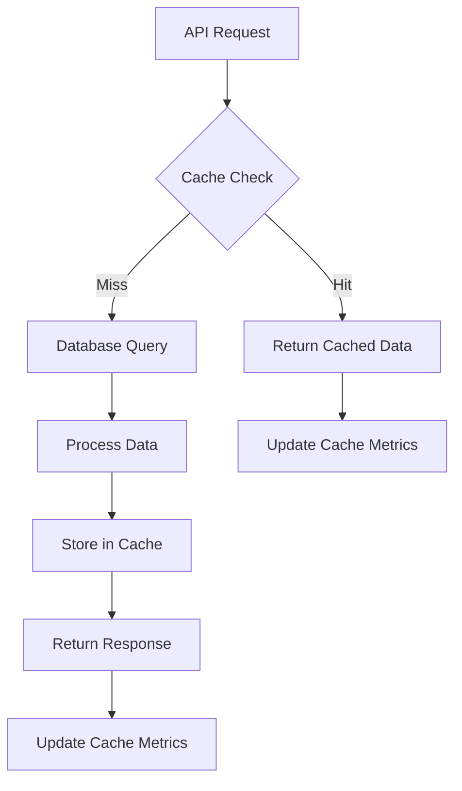

**Implementation Priority:** HIGH

**Components Needed:**
- Redis server setup and configuration
- Cache middleware for API routes
- Cache invalidation strategies
- Cache performance monitoring

##### Database Query Optimization Flow
```sql
-- Missing: Query result caching
-- Missing: Database connection pooling optimization
-- Missing: Read/write splitting
-- Missing: Query performance monitoring
```

### 2. Real-time Performance Optimization

#### Current State
- WebSocket implementation for chat
- No connection pooling strategy
- No message queuing system
- No offline message handling

#### Missing Flows

##### WebSocket Connection Management
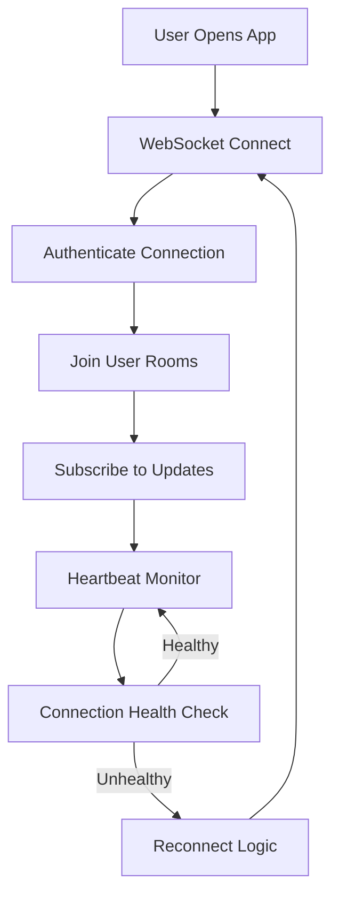

##### Message Queuing System
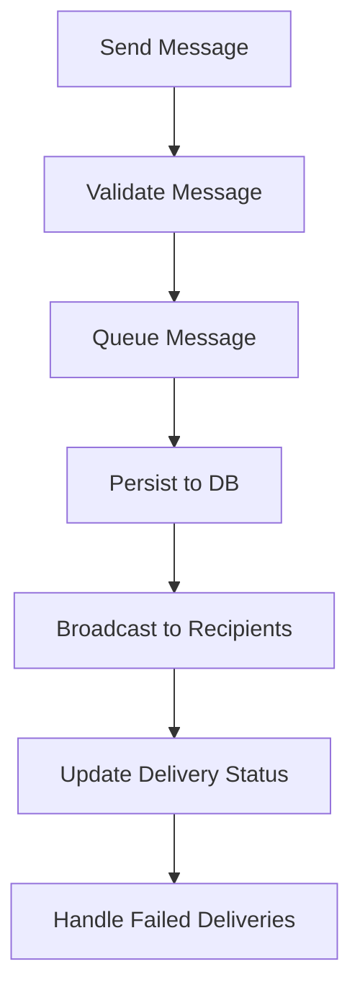

### 3. File Upload Optimization

#### Current State
- Basic file upload to VPS
- No CDN integration
- No image optimization
- No upload progress tracking

#### Missing Flows

##### CDN Integration Flow
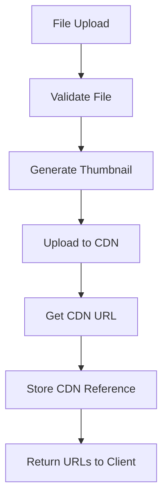

##### Image Optimization Pipeline
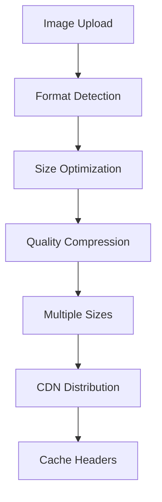

### 4. Payment Processing Enhancement

#### Current State
- Basic Paymob integration planned
- No payment retry logic
- No fraud detection
- No payment analytics

#### Missing Flows

##### Advanced Payment Flow
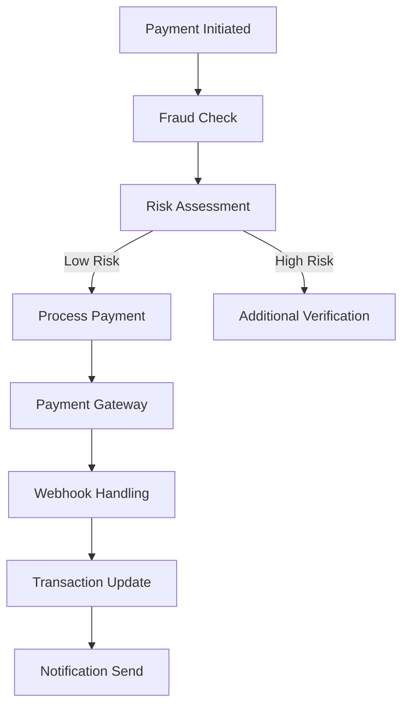

##### Payment Retry Logic
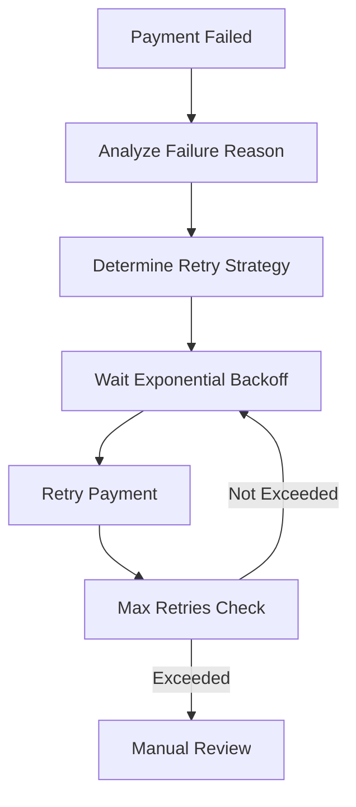

### 5. Database Optimization

#### Current State
- Single PostgreSQL instance
- No read replicas
- No connection pooling
- No query optimization

#### Missing Flows

##### Database Read/Write Splitting
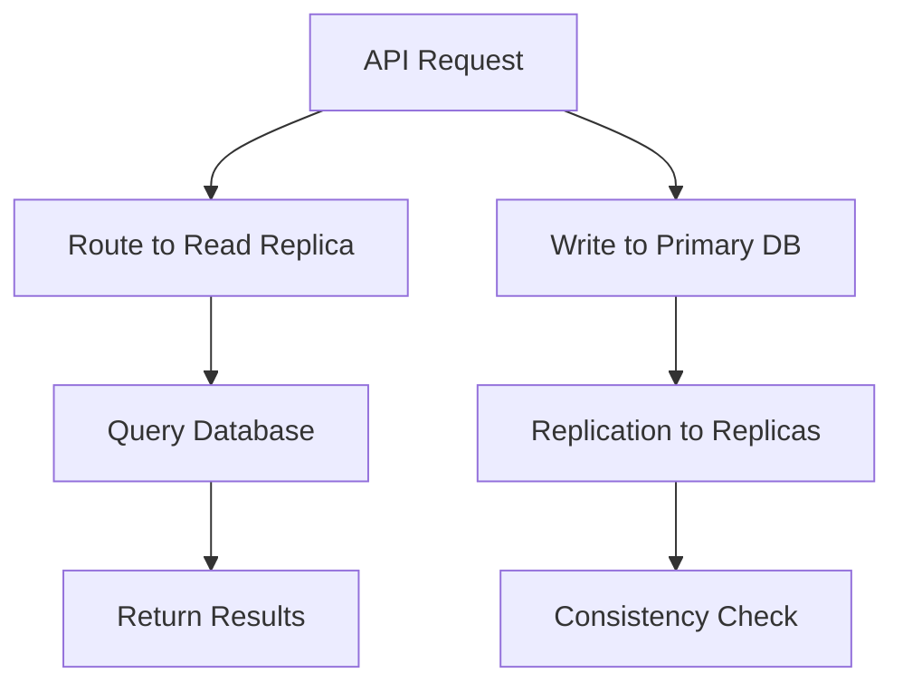

##### Connection Pooling
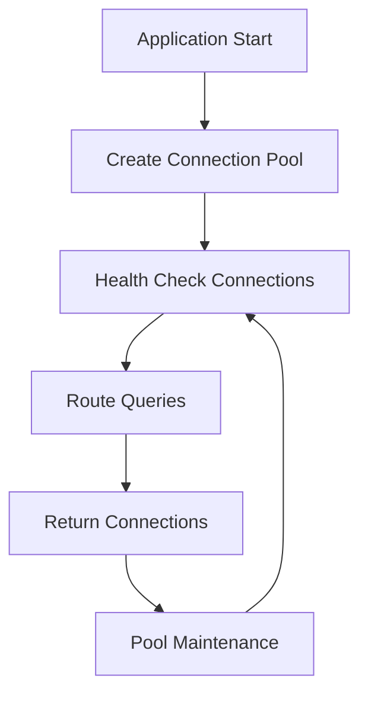

### 6. Monitoring and Analytics

#### Current State
- Basic health check endpoint
- No performance monitoring
- No error tracking
- No user analytics

#### Missing Flows

##### Performance Monitoring Pipeline
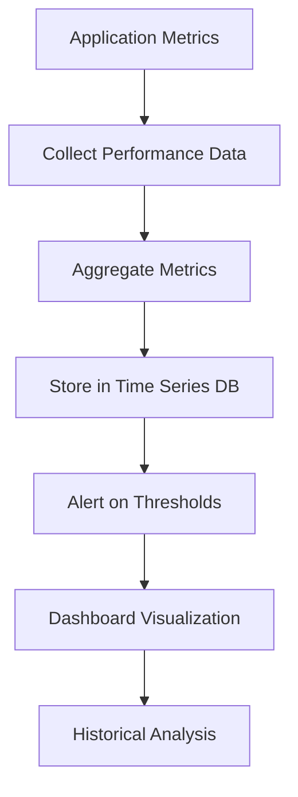

##### Error Tracking Flow
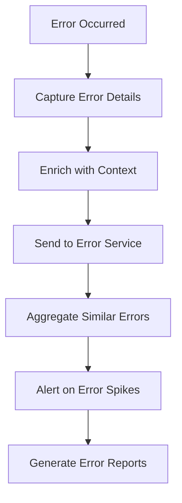

### 7. Scalability Enhancements

#### Current State
- Single VPS deployment
- No load balancing
- No auto-scaling
- No microservices separation

#### Missing Flows

##### Horizontal Scaling Architecture
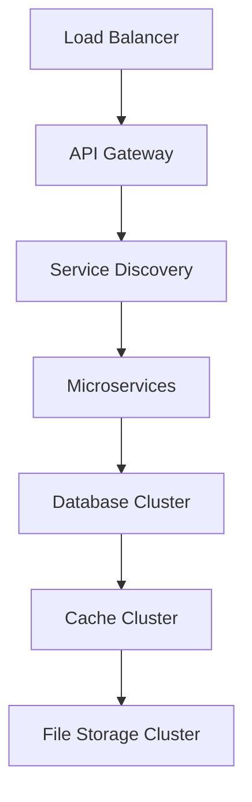

##### Auto-Scaling Flow
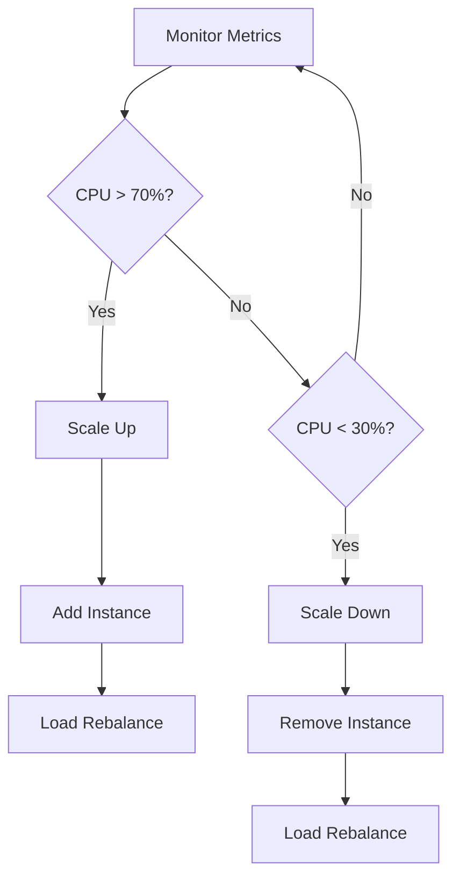

## Implementation Priority Matrix

### High Priority (Implement First)

#### P0: Critical for MVP Success
1. **Redis Caching Setup**
   - Session storage
   - API response caching
   - Database query caching

2. **Database Connection Pooling**
   - Optimize PostgreSQL connections
   - Implement PgBouncer
   - Connection health monitoring

3. **Error Handling Enhancement**
   - Structured error responses
   - Error tracking service integration
   - User-friendly error messages

#### P1: Important for Early Growth
1. **CDN Integration for File Storage**
   - CloudFlare or similar for media files
   - Image optimization pipeline
   - Geographic distribution

2. **Basic Monitoring Setup**
   - Application performance monitoring
   - Database performance metrics
   - Error rate tracking

### Medium Priority (Growth Phase)

#### P2: Scale Optimization
1. **Advanced Payment Processing**
   - Payment retry logic
   - Fraud detection integration
   - Payment analytics

2. **Real-time Performance Optimization**
   - WebSocket connection pooling
   - Message queuing system
   - Offline message handling

#### P3: Advanced Features
1. **Load Balancing Setup**
   - Multiple VPS instances
   - Load balancer configuration
   - Health check implementation

2. **Database Optimization**
   - Read replica setup
   - Query optimization
   - Database sharding preparation

### Low Priority (Enterprise Scale)

#### P4: Future Enhancements
1. **Microservices Architecture**
   - Service separation
   - Independent scaling
   - Service mesh implementation

2. **Advanced Analytics**
   - User behavior analytics
   - Business intelligence
   - Predictive scaling

## Performance Benchmarks

### Current Performance Targets (MVP)
- **API Response Time**: < 500ms for simple queries
- **File Upload**: < 5 seconds for 20MB files
- **Chat Message Delivery**: < 100ms
- **Database Query Time**: < 200ms for complex queries

### Growth Performance Targets
- **API Response Time**: < 200ms for cached responses
- **Concurrent Users**: 400+ chat users
- **File Upload**: < 2 seconds with CDN
- **Database Query Time**: < 50ms for cached queries

## Technical Debt Identification

### Code Quality Improvements
1. **Testing Coverage**
   - Unit tests for all services
   - Integration tests for critical flows
   - Performance tests for bottlenecks

2. **Code Organization**
   - Service layer separation
   - Repository pattern implementation
   - Dependency injection setup

3. **Documentation**
   - API documentation with examples
   - Architecture decision records
   - Deployment runbooks

### Infrastructure Improvements
1. **DevOps Automation**
   - Infrastructure as Code (Terraform)
   - Automated deployment pipelines
   - Configuration management

2. **Security Enhancements**
   - Rate limiting implementation
   - DDoS protection
   - Security headers and policies

## Implementation Roadmap

### Phase 1: Foundation (Week 1-2)
```markdown
**Week 1:**
- [ ] Redis setup and basic caching
- [ ] Database connection pooling
- [ ] Error handling enhancement

**Week 2:**
- [ ] Basic monitoring setup
- [ ] CDN integration for file storage
- [ ] Performance testing framework
```

### Phase 2: Optimization (Week 3-4)
```markdown
**Week 3:**
- [ ] Advanced caching strategies
- [ ] Database query optimization
- [ ] WebSocket performance tuning

**Week 4:**
- [ ] Payment processing enhancement
- [ ] Real-time feature optimization
- [ ] Load testing implementation
```

### Phase 3: Scale Preparation (Week 5-6)
```markdown
**Week 5:**
- [ ] Multi-instance setup
- [ ] Load balancer configuration
- [ ] Database read replicas

**Week 6:**
- [ ] Auto-scaling policies
- [ ] Advanced monitoring
- [ ] Disaster recovery setup
```

## Success Metrics

### Performance Metrics
- **Response Time**: P95 < 200ms for API calls
- **Throughput**: 1000+ requests/second capacity
- **Error Rate**: < 0.1% for critical operations
- **Uptime**: 99.9% availability

### Scalability Metrics
- **Concurrent Users**: 1000+ simultaneous users
- **Data Growth**: Support for 100GB+ of data
- **Deployment Time**: < 5 minutes for updates
- **Scaling Time**: < 10 minutes to add capacity

## Risk Assessment

### High-Risk Missing Components
1. **No Caching Strategy** - Performance degradation under load
2. **Single Point of Failure** - VPS downtime affects entire platform
3. **No Monitoring** - Issues detected too late
4. **Basic Error Handling** - Poor user experience

### Mitigation Strategies
1. **Implement caching early** - Redis setup in development phase
2. **Backup server strategy** - Secondary VPS for critical operations
3. **Comprehensive monitoring** - Alert system for all critical metrics
4. **Enhanced error handling** - User-friendly error messages and recovery

## Cost-Benefit Analysis

### High-Impact, Low-Cost Improvements
1. **Redis Caching** - $5-10/month, major performance improvement
2. **CDN Integration** - $10-20/month, better file loading
3. **Basic Monitoring** - Free tier available, critical for operations
4. **Error Tracking** - Free tier, essential for debugging

### High-Impact, Higher-Cost Improvements
1. **Load Balancer** - $20-50/month, enables scaling
2. **Database Replicas** - $15-30/month, improves read performance
3. **Auto-scaling** - $10-25/month, handles traffic spikes
4. **Advanced Analytics** - $20-50/month, business insights

## Next Steps

### Immediate Actions (This Week)
1. **Set up Redis** for session storage and caching
2. **Implement database connection pooling**
3. **Add comprehensive error handling**
4. **Set up basic monitoring with alerts**

### Short-term Goals (Next Month)
1. **CDN integration** for file storage
2. **Database query optimization**
3. **Payment processing enhancement**
4. **Performance testing framework**

### Long-term Vision (Next Quarter)
1. **Multi-instance deployment**
2. **Advanced monitoring and analytics**
3. **Auto-scaling capabilities**
4. **Microservices preparation**

## Conclusion

The current architecture provides a solid foundation for an MVP, but implementing these missing flows will transform it into a high-performance, scalable platform capable of handling significant growth. The priority should be on foundational improvements (caching, monitoring, error handling) before scaling enhancements.

**Key Recommendation**: Start with Redis caching and basic monitoring implementation immediately, as these will provide the biggest impact on user experience and operational visibility with minimal cost and effort.