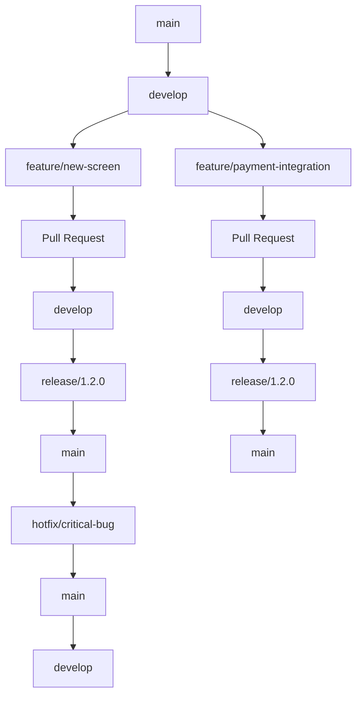

# Version Control Strategy for Flutter Android Project

## Git Repository Structure

### Monorepo vs Multi-Repo Approach

#### Recommended: Multi-Repository Structure
```
your-organization/
├── trusted-backend/           # Node.js/TypeScript API
│   ├── src/
│   ├── tests/
│   └── README.md
│
├── trusted-flutter/           # Flutter mobile application
│   ├── lib/
│   ├── android/
│   ├── ios/
│   ├── test/
│   └── pubspec.yaml
│
└── trusted-docs/              # Shared documentation
    ├── api/
    ├── guides/
    └── README.md
```

#### Repository Independence Benefits
- **Independent Releases**: Deploy backend and mobile app separately
- **Different Cadence**: Mobile apps typically update less frequently
- **Team Autonomy**: Each developer manages their repository
- **CI/CD Optimization**: Separate pipelines for different tech stacks

## Flutter Project Version Management

### Versioning Strategy

#### Semantic Versioning for Flutter Apps
```yaml
# pubspec.yaml
name: trusted
version: 1.2.3+4

# Version components:
# 1.2.3+4
# │ │ │ │
# │ │ │ └─ Build number (4)
# │ │ └─── Patch version (3) - Bug fixes
# │ └───── Minor version (2) - New features
# └─────── Major version (1) - Breaking changes
```

#### Version Increment Rules
- **Major (X.y.z)**: Breaking changes in API integration or Flutter SDK
- **Minor (x.Y.z)**: New features, UI improvements, performance enhancements
- **Patch (x.y.Z)**: Bug fixes, security patches, dependency updates
- **Build (+build)**: Internal builds, hotfixes, platform-specific updates

### Branch Strategy

#### Git Flow for Flutter Projects


#### Branch Types and Purposes

##### Main Branches
- **`main`**: Production-ready code, tagged releases only
- **`develop`**: Integration branch for features, always deployable

##### Supporting Branches
- **`feature/*`**: New features or enhancements
- **`bugfix/*`**: Bug fixes for develop branch
- **`hotfix/*`**: Critical fixes for main branch
- **`release/*`**: Release preparation and testing

### Flutter-Specific Git Practices

#### Commit Message Convention
```bash
# Feature commits
feat: add biometric authentication support
feat: implement dark mode theme

# Bug fixes
fix: resolve chat message duplication
fix: correct payment validation logic

# UI/UX improvements
ui: redesign marketplace card layout
ui: improve loading animations

# Performance optimizations
perf: optimize image loading with caching
perf: reduce app startup time by 40%

# Dependency updates
deps: update Flutter SDK to 3.13.0
deps: upgrade payment package to v2.1.0

# Documentation
docs: update API integration guide
docs: add setup instructions for new developers
```

#### Flutter Project Structure in Git
```bash
trusted-flutter/
├── .gitignore                    # Flutter-specific ignores
├── pubspec.yaml                  # Dependencies and version
├── lib/                          # Main application code
│   ├── main.dart
│   ├── src/
│   │   ├── models/              # Data models
│   │   ├── services/            # API services
│   │   ├── screens/             # UI screens
│   │   ├── widgets/             # Reusable widgets
│   │   └── utils/               # Utilities
├── android/                      # Android-specific code
├── ios/                         # iOS-specific code
├── test/                        # Unit and widget tests
├── build/                       # Build outputs (generated)
└── README.md
```

### Release Management

#### Release Branch Workflow
```bash
# Create release branch
git checkout develop
git checkout -b release/1.2.0

# Update version in pubspec.yaml
# Version: 1.2.0+1

# Final testing and bug fixes
git commit -m "release: prepare version 1.2.0"

# Merge to main
git checkout main
git merge release/1.2.0

# Tag release
git tag -a v1.2.0 -m "Release version 1.2.0"

# Merge back to develop
git checkout develop
git merge release/1.2.0

# Push changes
git push origin main develop --tags
```

#### Pre-Release Checklist
```markdown
**Code Quality:**
- [ ] All tests passing (unit, widget, integration)
- [ ] Code review completed and approved
- [ ] No linting errors or warnings
- [ ] Dependencies updated and secure

**Flutter-Specific Checks:**
- [ ] App builds successfully for Android
- [ ] No deprecated API usage
- [ ] Performance optimizations applied
- [ ] Platform-specific code tested

**Release Preparation:**
- [ ] Version number updated in pubspec.yaml
- [ ] Release notes prepared
- [ ] Screenshots updated (if needed)
- [ ] Store descriptions reviewed
```

## Android-Specific Version Management

### Android Version Configuration

#### Gradle Version Management
```groovy
// android/app/build.gradle
android {
    compileSdkVersion 34

    defaultConfig {
        applicationId "com.trusted.app"
        minSdkVersion 21
        targetSdkVersion 34
        versionCode 4        // Increment for each release
        versionName "1.2.3"  // Match pubspec.yaml version
    }
}
```

#### Version Code Strategy
```kotlin
// Version code calculation
val major = 1
val minor = 2
val patch = 3
val build = 4

// Format: MNNPPBB (Major, Minor, Patch, Build)
val versionCode = major * 10000 + minor * 1000 + patch * 100 + build
// Result: 1020304
```

### Android App Bundle (AAB) Generation

#### Build Commands
```bash
# Build APK for testing
flutter build apk --release

# Build App Bundle for Play Store
flutter build appbundle --release

# Build for specific architecture (optional)
flutter build apk --release --target-platform android-arm64
```

#### Signing Configuration
```groovy
// android/app/build.gradle
android {
    signingConfigs {
        release {
            storeFile file('key.jks')
            storePassword 'store_password'
            keyAlias 'key_alias'
            keyPassword 'key_password'
        }
    }

    buildTypes {
        release {
            signingConfig signingConfigs.release
            minifyEnabled true
            proguardFiles getDefaultProguardFile('proguard-android.txt'), 'proguard-rules.pro'
        }
    }
}
```

## Continuous Integration & Deployment

### CI/CD Pipeline for Flutter

#### GitHub Actions Workflow
```yaml
# .github/workflows/flutter-ci.yml
name: Flutter CI/CD

on:
  push:
    branches: [ main, develop ]
  pull_request:
    branches: [ main, develop ]

jobs:
  test:
    runs-on: ubuntu-latest
    steps:
      - uses: actions/checkout@v3
      - uses: subosito/flutter-action@v2
        with:
          flutter-version: '3.13.0'

      - name: Install dependencies
        run: flutter pub get

      - name: Run tests
        run: flutter test

      - name: Build APK
        run: flutter build apk --release

      - name: Upload artifacts
        uses: actions/upload-artifact@v3
        with:
          name: release-apk
          path: build/app/outputs/apk/release/
```

#### Automated Release Process
```yaml
# .github/workflows/release.yml
name: Create Release

on:
  push:
    tags:
      - 'v*'

jobs:
  build-and-release:
    runs-on: ubuntu-latest
    steps:
      - uses: actions/checkout@v3
      - uses: subosito/flutter-action@v2

      - name: Build APK and App Bundle
        run: |
          flutter pub get
          flutter build apk --release
          flutter build appbundle --release

      - name: Create Release
        uses: softprops/action-gh-release@v1
        with:
          files: |
            build/app/outputs/apk/release/*.apk
            build/app/outputs/bundle/release/*.aab
          generate_release_notes: true
```

## Dependency Management

### Flutter Package Updates

#### Update Strategy
```bash
# Check for outdated packages
flutter pub outdated

# Update specific package
flutter pub upgrade package_name

# Update all packages
flutter pub upgrade

# Update Flutter SDK
flutter upgrade
```

#### Dependency Lock Strategy
```yaml
# pubspec.yaml
dependencies:
  flutter:
    sdk: flutter
  http: ^1.1.0        # Use caret (^) for compatible updates
  provider: ^6.0.0    # Allows patch and minor updates

dev_dependencies:
  flutter_test:
    sdk: flutter
  flutter_lints: ^2.0.0
```

### Platform-Specific Dependencies

#### Android Dependencies
```groovy
// android/app/build.gradle
dependencies {
    implementation 'androidx.appcompat:appcompat:1.6.1'
    implementation 'com.google.android.material:material:1.10.0'
    implementation 'androidx.constraintlayout:constraintlayout:2.1.4'
}
```

## Code Review Process

### Flutter-Specific Review Checklist

#### Code Quality
```markdown
**Flutter Best Practices:**
- [ ] Widgets are properly disposed
- [ ] Async operations handled correctly
- [ ] Platform-specific code in appropriate files
- [ ] Proper error handling implemented
- [ ] Loading states considered

**Performance:**
- [ ] Images optimized and cached
- [ ] Lists use ListView.builder for large datasets
- [ ] Heavy operations moved off UI thread
- [ ] Memory leaks prevented

**UI/UX:**
- [ ] Responsive design implemented
- [ ] Accessibility features included
- [ ] Loading indicators provided
- [ ] Error states handled gracefully
```

## Rollback Strategy

### Emergency Rollback Process

#### Git-Based Rollback
```bash
# Quick rollback to previous commit
git revert HEAD --no-edit
git push origin main

# Rollback to specific tag
git reset --hard v1.1.0
git push origin main --force
```

#### Play Store Rollback
1. **Internal Testing Track**: Deploy previous version for testing
2. **Gradual Rollout**: Slowly release to percentage of users
3. **Full Rollback**: Promote previous version to 100%

### Database Migration Rollback
```sql
-- If schema changes need rollback
-- Create reverse migration scripts
-- Test rollback in staging first
```

## Monitoring and Analytics

### Version Tracking
```dart
// lib/utils/version_tracker.dart
class VersionTracker {
  static Future<String> getCurrentVersion() async {
    PackageInfo packageInfo = await PackageInfo.fromPlatform();
    return packageInfo.version;
  }

  static Future<int> getBuildNumber() async {
    PackageInfo packageInfo = await PackageInfo.fromPlatform();
    return int.parse(packageInfo.buildNumber);
  }

  static Future<void> trackVersionUsage() async {
    // Send version info to analytics
    final version = await getCurrentVersion();
    // Analytics.track('app_version', version);
  }
}
```

### Crash Reporting Integration
```yaml
# pubspec.yaml dependencies
dependencies:
  firebase_crashlytics: ^3.4.0
```

## Documentation Updates

### Version-Specific Documentation

#### Release Documentation Structure
```
docs/
├── releases/
│   ├── v1.2.3/
│   │   ├── release-notes.md
│   │   ├── migration-guide.md
│   │   └── known-issues.md
│   ├── v1.2.2/
│   └── v1.2.1/
├── api/
│   └── changelog.md
└── guides/
    ├── setup.md
    └── troubleshooting.md
```

#### Release Notes Template
```markdown
# Trusted v1.2.3 Release Notes

## What's New
- ✨ Added biometric authentication support
- 🚀 Improved app performance by 25%
- 🐛 Fixed critical payment processing bug

## Improvements
- Enhanced UI responsiveness
- Better error handling for network issues
- Updated dependencies for security

## Known Issues
- Minor UI glitch on Android 9 devices (fixed in next release)

## Installation
1. Update from Play Store
2. Or download APK from releases page

## Support
For issues, contact support@trusted.com
```

## Security Considerations

### Code Signing Security
```bash
# Generate upload key for Play Store
keytool -genkeypair -alias upload -keyalg RSA -keysize 2048 -validity 9125 -keystore keystore.jks

# Secure keystore storage
# Store in secure location, not in repository
# Use different keys for debug and release
```

### Sensitive Data Protection
```dart
// lib/config/secrets.dart
class Secrets {
  static const String apiKey = String.fromEnvironment('API_KEY');
  static const String encryptionKey = String.fromEnvironment('ENCRYPTION_KEY');
}
```

## Performance Monitoring

### Flutter Performance Tracking
```dart
// lib/services/performance_monitor.dart
class PerformanceMonitor {
  static void trackScreenLoad(String screenName) {
    // Track how long screens take to load
  }

  static void trackApiCall(String endpoint, Duration duration) {
    // Monitor API performance
  }

  static void trackMemoryUsage() {
    // Monitor memory consumption
  }
}
```

## Compliance and Regulations

### App Store Guidelines Compliance

#### Google Play Store Requirements
- **Target API Level**: 34 (Android 14)
- **Permissions**: Justify all permissions requested
- **Privacy Policy**: Link to privacy policy URL
- **Content Rating**: Appropriate rating for target audience

#### App Bundle Optimization
```bash
# Optimize for Play Store delivery
flutter build appbundle --release --target-platform android-arm,android-arm64,android-x64

# Enable R8/ProGuard for smaller APK size
flutter build apk --release --shrink
```

## Backup and Recovery

### Repository Backup Strategy
```bash
# Mirror repositories to multiple locations
git remote add backup git@backup-server:trusted-flutter.git

# Regular backups
git push backup main

# Backup with all tags and branches
git push backup --all --tags
```

### Critical File Backup
```bash
# Backup essential files
backup_files=(
  "android/app/key.jks"
  "android/app/google-services.json"
  "ios/Runner/GoogleService-Info.plist"
  "lib/config/secrets.dart"
)

# Store securely off-repository
```

## Team Collaboration Rules

### Flutter-Specific Git Rules

#### Pull Request Requirements
```markdown
**PR Template:**
```markdown
## Description
Brief description of changes

## Type of Change
- [ ] Bug fix
- [ ] New feature
- [ ] Breaking change
- [ ] Documentation update

## Testing
- [ ] Unit tests added/updated
- [ ] Widget tests added/updated
- [ ] Integration tests added/updated
- [ ] Tested on physical device

## Screenshots
Before/after screenshots if UI changes

## Checklist
- [ ] Code follows project style
- [ ] No linting errors
- [ ] Performance impact considered
- [ ] Security implications reviewed
```
```

#### Code Review Standards
- **Approval Threshold**: At least one approved review
- **Testing Requirement**: All PRs must have tests
- **Documentation**: Update docs for new features
- **Breaking Changes**: Clearly marked and communicated

## Success Metrics

### Version Control Metrics
- **Branch Lifetime**: Feature branches < 2 weeks
- **PR Size**: Changes < 500 lines per PR
- **Review Time**: < 24 hours for average PR
- **Merge Frequency**: Daily merges to develop

### Release Metrics
- **Release Cadence**: Every 2-4 weeks
- **Rollback Rate**: < 5% of releases
- **User Adoption**: > 80% update within 2 weeks
- **Crash Rate**: < 0.1% per version

## Troubleshooting Common Issues

### Flutter-Specific Git Issues

#### Large Repository Size
```bash
# Clean up unnecessary files
flutter clean

# Remove unused assets
find assets/ -name "*.png" -o -name "*.jpg" | xargs ls -la

# Optimize images
flutter pub run flutter_image_compress
```

#### Build Conflicts
```bash
# Clean and rebuild
flutter clean
flutter pub get
flutter build apk --release

# Clear Gradle cache
rm -rf ~/.gradle/caches

# Restart IDE if needed
```

#### Dependency Conflicts
```bash
# Check dependency tree
flutter pub deps

# Resolve conflicts
flutter pub upgrade --major-versions

# Clear pub cache if needed
flutter pub cache clean
```

## Future Enhancements

### Advanced Version Management
- **Automated Version Bumping**: CI-based version increments
- **Release Branch Automation**: Automated release branch creation
- **Multi-Environment Config**: Environment-specific builds
- **Feature Flags**: Runtime feature toggling

### Enhanced CI/CD
- **Automated Testing**: More comprehensive test suites
- **Performance Regression**: Automated performance testing
- **Security Scanning**: Automated vulnerability scanning
- **Distribution**: Automated beta distribution to testers